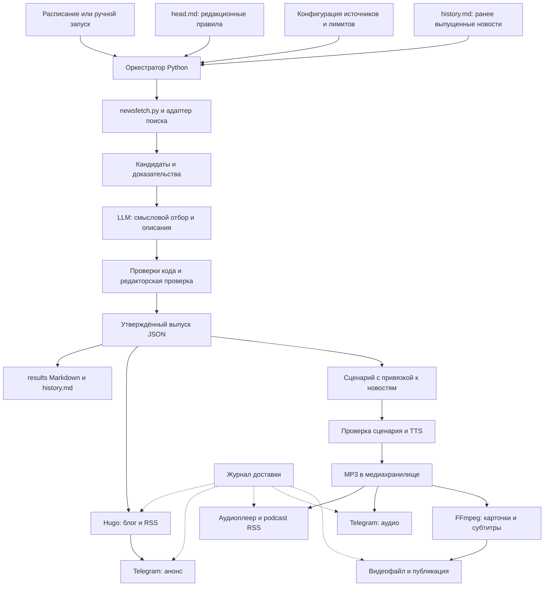

# План: автоматический выпуск новостей, блог, Telegram и подкаст

Дата: 2026-09-19. Репозиторий: `/Volumes/DATA-R1/Dev/AI/news`. Проверенная ревизия: `88694ce`.

Статус: проектный план. Код, промпт, история и существующие выпуски не изменены; внешние публикации и расписания не создавались. Возможности сервисов проверены по официальной документации на дату плана. Выбор аккаунтов, тарифов и доступность API из будущей среды исполнения ещё не проверены.

## 1. Предлагаемое решение

Сделать **один процесс подготовки проверенного выпуска и несколько способов его доставки**:

1. **Блог** — полный выпуск, архив, рубрики, ссылки на источники, позднее аудиоплеер и расшифровка.
2. **Telegram-канал** — короткий анонс с несколькими главными новостями и ссылкой на полный выпуск; отдельно аудиозапись.
3. **Аудиоподкаст** — сценарий из того же проверенного материала, озвучка, MP3 и подписка через отдельный podcast RSS.
4. **Видеоподкаст** — последующее расширение: озвучка, карточки новостей, субтитры и главы.

Рекомендуемый стек: существующий Python-загрузчик и новый Python-оркестратор → структурированный выпуск → **Hugo + GitHub Pages** для блога, **Telegram Bot API** для доставки, **TTS API + FFmpeg** для аудио. Медиа хранить отдельно от Git и текстового сайта, например в Cloudflare R2 с собственным доменом.

Внедрять последовательно: **публикация готовых `results` → автоматический сбор и проверка → аудио → видео**. Уже на первом этапе появляется полезный сайт; автоматизация сложного отбора не блокирует его запуск.

Исходные предположения: русский язык, еженедельный выпуск, один редактор, публичный бесплатный блог, небольшой начальный трафик. Это рабочие допущения, а не полученные от владельца требования. Если задача исключительно личная, можно остановиться на закрытом Telegram-канале с текстом и MP3: публичный сайт и каталоги подкастов тогда необязательны.

## 2. Что уже есть и что действительно предстоит разработать

| Подтверждённый факт | Основание | Значение для плана |
|---|---|---|
| Основной сценарий описан инструкциями для агента | `news/head.md:1`, `:319`, `:776` | Запуск загрузчика по расписанию сам по себе не создаст дайджест |
| Загрузчик выполняет транспорт и разбор, а отбор, оценка, дедупликация и итоговый отчёт остаются в промпте | `scripts/newsfetch.py:1`, `:742` | Переиспользовать загрузчик; добавить управляющий процесс |
| Есть два режима, `feeds` и `pages`, с JSONL-выводом | `README.md:25`, `scripts/newsfetch.py:742` | Уже существует удобная граница между сетью и обработкой |
| Квоты, окно, резервные источники, бюджет и правила верификации определены | `news/head.md:9`, `:144`, `:368`, `:582`, `:669` | Это требования к автоматизации, а не настройки, которые можно молча упростить |
| `history.md` — единственный постоянный реестр дедупликации | `news/head.md:25`, `:881` | Не заменять его памятью модели или независимой второй историей |
| Сохранение отчёта и истории должно быть согласованным | `news/head.md:776`, `:881` | Внешняя доставка требует отдельного состояния и повторов |
| Публичный Markdown имеет строгий формат: три колонки, без технических полей | `news/head.md:847` | Метаданные хранить отдельно; формат `results` сохранить |
| Есть восемь Markdown-выпусков; последний содержит 35 новостей, в истории ему соответствуют 35 строк; всего в истории 256 строк | Подсчёт файлов и строк Python-скриптом, `results/2026-09-19--12-33.md`, `news/history.md` | Есть реальные данные для пилота; соответствие содержания всех исторических строк отдельно не аудировалось |
| Каталога `.github` и проектного `PROJECT.md` сейчас нет | Проверка дерева репозитория | CI и правила публикации предстоит добавить |
| Существующие девять тестов загрузчика проходят без сети | `python3 -m unittest discover -s tests -v` | Базовый парсер проверен; это не проверка будущего сайта или качества новостей |

Особенности, влияющие на реализацию:

- `parse_page` возвращает ограниченную выжимку текста, по умолчанию 1500 символов (`scripts/newsfetch.py:471`, `:770`). Нельзя называть такую выжимку полным текстом или писать по ней подробный разбор, если нужных фактов в ней нет.
- Счётчики повторов живут внутри экземпляра `FetchClient` (`scripts/newsfetch.py:226`). Оркестратор должен контролировать бюджет всего выпуска и возобновления; новый процесс не даёт права заново потратить весь резерв.
- Для `maker` и некоторых других рубрик существенен резервный поиск (`news/head.md:368`, `:969`). API текстовой модели не является автоматической заменой поискового API.
- Короткие ленты могут не содержать все новости недели (`news/head.md:207`). Ежедневный сбор кандидатов позднее может улучшить покрытие, но требует отдельно пересмотреть недельный сетевой бюджет.

## 3. Сравнение вариантов

| Вариант | Сильные стороны | Цена сложности | Когда выбирать |
|---|---|---|---|
| **Hugo + GitHub Pages** | Подходит к Git и Markdown; переносимый архив; статические страницы без обслуживаемой БД | Редактирование через репозиторий; шаблоны и публикационный процесс нужно сделать | **Основной вариант для текущего репозитория** |
| **Ghost** | Готовая редакционная среда; можно отправлять материалы через Admin API | Отдельный сервис, его оплата либо обслуживание; синхронизация редакторских правок с исходными данными | Если нужен прежде всего удобный браузерный редактор |
| **Только Telegram** | Быстрее получить регулярную доставку; текст и аудио рядом | Архив и навигация зависят от платформы; длинные выпуски неудобно читать в канале | Личная подписка или проверка интереса аудитории |
| **n8n + выбранный блог/Telegram** | Визуальные шаги, расписание, соединение сервисов | n8n тоже нужно размещать и обслуживать либо оплачивать; сложные правила отбора остаются в коде | Если важнее визуальное управление интеграциями |
| **Постоянный VPS + Python** | Постоянное состояние, контроль расписания и среды | Обновления, резервные копии, мониторинг и администрирование | При росте нагрузки или требованиях к точности расписания |

Hugo документирует публикацию на GitHub Pages через Actions. Ghost умеет создавать посты через API, включая приём HTML; преобразование HTML в его внутренний формат может менять разметку. n8n имеет Schedule Trigger с настройкой часового пояса. Эти возможности подтверждены, сравнительная оценка удобства — рекомендация для данного проекта. [Hugo](https://gohugo.io/host-and-deploy/host-on-github-pages/), [Ghost](https://docs.ghost.org/admin-api/posts/creating-a-post), [n8n](https://docs.n8n.io/integrations/builtin/core-nodes/n8n-nodes-base.scheduletrigger/).

Не вводить одновременно Hugo, Ghost и n8n в первый выпуск. Выбрать один способ публикации сайта и один исполнитель расписания. Возможность заменить их обеспечивается форматом выпуска и небольшими адаптерами.

## 4. Как будет выглядеть блог

Рабочее название можно взять из README — «Летопись»; окончательное название и домен выбирает владелец.

**Главная:** последний выпуск, период новостей, короткое оглавление рубрик, кнопки «Читать», «Слушать», «Подписаться». Кнопка прослушивания появляется только после готовности аудио.

**Страница выпуска:** устойчивый адрес, например `/issues/2026-09-19--12-33/`; заголовки рубрик и карточки с названием, исходной ссылкой и теми же краткими описаниями, что в Markdown. Для телефона использовать вертикальные карточки. Перегруппировка — только отображение: состав и факты выпуска сохраняются.

**Архив:** список выпусков по датам и фильтр рубрики. Отдельные страницы каждой новости, комментарии, аккаунты, платежи и сложный поиск в MVP не нужны.

**Служебные страницы для читателя:** как отбираются новости; как сообщить об ошибке; указание на применение ИИ при подготовке и синтетический голос. У каждого выпуска — дата формирования; после исправления — понятная отметка об исправлении.

**Подписки:** обычный RSS со статьями блога; позднее отдельный podcast RSS с аудиофайлами. Telegram ведёт на постоянную страницу выпуска, а не на временный CI-артефакт.

Технический журнал, оценки веса, ключи дедупликации и содержимое окружения в сайт не попадают. Сайт собирается из явного списка разрешённых публичных полей, а не копированием корня репозитория.

## 5. Архитектура и контракты



### 5.1. Разделить подготовку и доставку

**Подготовка:** обнаружение → фильтры → оценка → верификация → черновик → проверки → утверждение → сохранение выпуска и истории.

**Доставка:** взять сохранённую версию → опубликовать сайт → проверить доступность → отправить анонс; аудио и видео выполняются отдельными дополнительными ветками.

Каждый адаптер принимает уже подготовленный материал и возвращает подтверждение доставки: канал, идентификатор выпуска, версию, хеш содержимого, внешний ID/URL, время, статус. Он не выбирает новости и не редактирует историю.

### 5.2. Единый структурированный выпуск

Добавить версионируемую JSON-схему. Для новых автоматических выпусков JSON — каноническое содержимое конкретной версии, Markdown и страницы — его представления. `history.md` сохраняет свою отдельную роль: канонический реестр дедупликации между выпусками. Журнал доставки отвечает только за публикацию в каналах.

| Объект | Обязательные данные |
|---|---|
| Выпуск | `schema_version`, `edition_id`, `revision`, `run_at`, часовой пояс, начало/конец окна, статус, версия промпта и конфигурации, список новостей |
| Новость | `item_id`, категория, заголовок, описание, нормализованный URL, дата и точность даты, семантический ключ, сущности, устойчивые ID |
| Проверка новости | Способ подтверждения даты и факта, URL источника, полученная выжимка или ссылка на закрытый evidence-артефакт, время получения, хеш; явные исключения вроде Habr fallback |
| Диагностика выпуска | Недобор по рубрикам и его причины, ошибки источников, покрытие окна, расход сетевого и модельного бюджетов |
| Производный материал | Исходный `edition_id` и хеш версии, тип материала, использованные `item_id`, статус проверки, хеш результата |
| Доставка | Канал, выпуск, revision, попытка, статус, внешний ID/URL, хеш отправленного материала |

`edition_id` выдавать один раз. Повтор запуска того же запланированного окна находит существующий выпуск по ключу «окно + набор категорий + профиль выпуска»; он не создаёт новый только из-за нового времени запуска. Намеренная новая редакция оформляется явно. Исторические выпуски сохраняют идентичность по имени своего файла, даже если их окна совпадают.

Не пытаться восстановить неизвестные доказательства старых выпусков. Для импорта — `verification=legacy`, факты и метаданные брать только из существующих Markdown и соответствующих строк истории. При неоднозначности импорт останавливается с отчётом. Такой импорт не считается повторной проверкой первоисточников.

### 5.3. Что оставить модели, а что выполнять кодом

**Код:** окно, квоты, счётчики, разбор данных, точные дубли по URL/ID, схема, запись файлов, сортировка по полученным оценкам, экранирование, публикация и повторы.

**Модель:** смысловая новизна, факторы редакционной оценки, краткое объяснение значимости, перевод, текст сценария. Модель возвращает структурированные данные с привязкой к доступным источникам; новые URL из её памяти не принимаются.

Пример подходящего механизма — structured output у Gemini API; он помогает получить заданную структуру. Соответствие JSON-схеме само по себе не доказывает правильность фактов. Конкретную текстовую модель выбрать по пилоту на материалах этих шести рубрик. [Документация structured output](https://ai.google.dev/gemini-api/docs/structured-output).

Существующий промпт нельзя просто отправить обычному API-вызову и ожидать доступ к локальным файлам, поиску и записи результата. Все эти действия должен выполнять оркестратор. Подписка на интерактивный ИИ-сервис также не является подтверждением доступного API-бюджета.

### 5.4. Сохранение требований текущего промпта

- Сохранить календарное окно и точность исходных дат, квоты каждой категории, правила зоны поля, «новой сути» и повторной фильтрации после открытия страницы.
- Сохранить честный недобор: сбои либо слабые материалы не компенсируются выдумками и перераспределением квот.
- Перенести параметры и реестр источников в машиночитаемую конфигурацию только вместе с правкой `head.md`: для каждого значения остаётся один источник истины. Таблицы документации можно генерировать из конфигурации; две вручную поддерживаемые копии запрещены.
- Сохранять параметры, версию правил и доказательства для каждой попытки; повторная доставка не меняет их.
- Адаптер поиска обязан поддержать обычный резерв и специальный Habr fallback. Если поиск недоступен, выпуск получает явную диагностику и при необходимости удерживается для проверки.
- В MVP сохранять текущую модель сетевого бюджета и один `FetchClient` на сетевую фазу. Возвраты к поиску и добору реализовать контролируемой очередью; при возобновлении восстанавливать потраченные лимиты. Любое изменение этой модели сначала явно отразить в спецификации.

## 6. Состояние, сбои и режимы автоматизации

### 6.1. Жизненный цикл

Выпуск: `draft → validated → approved → finalized`; при дефекте — `needs_review` или `failed` с причиной. В режиме полного автомата переход `validated → approved` выполняет явно включённая политика, а не сама модель по своему усмотрению.

Каждый канал имеет независимое состояние: `not_started → in_progress → delivered`, либо `failed` / `unknown`. Не нужен общий флаг «всё опубликовано», который скрывает частичный успех.

Черновик не меняет канонический `history.md`. Для нового выпуска финализация сохраняет JSON, Markdown и новые строки истории одним изменением репозитория после повторной проверки актуальной истории. В Git-процессе это один проверенный коммит; простое последовательное переименование двух файлов не является общей атомарной транзакцией. До успешной финализации внешняя публикация запрещена.

История означает «новость включена в сохранённый выпуск», как и сейчас, а не «отправлена во все каналы». Если доставка упала после финализации, продолжить доставку сохранённого выпуска; не генерировать его заново и не удалять строки истории. Импорт существующего отчёта никогда повторно не добавляет его новости в историю.

### 6.2. Где хранить состояние при GitHub Actions

Для MVP — версионируемые выпуски в основной ветке и небольшой постоянный журнал доставки в выделенной ветке состояния. В нём только безопасные для данного репозитория метаданные; секреты и закрытая диагностика хранятся отдельно. Состояние должно быть отправлено в удалённое хранилище до завершения job. Workspace runner, cache и временные Actions artifacts не являются единственной копией состояния.

Все операции финализации и доставки сериализовать общей группой `concurrency` и проверкой актуальной ревизии состояния. Ручной запуск публикации использует тот же механизм; локальная публикация в обход него в MVP отключена. При конфликте обновления — перечитать состояние и остановить либо безопасно повторить операцию.

Перед внешним запросом сохранить намерение `in_progress`, после подтверждения — receipt с внешним ID. Если процесс упал между принятием запроса сервисом и сохранением ответа, результат **неизвестен**. Отсутствие receipt не доказывает, что публикации не было.

Для Telegram нет основания обещать строго однократную отправку только за счёт локального журнала: при неоднозначном исходе остановить повтор и запросить сверку существующего сообщения. Известный `message_id` позволяет обновить уже отправленный текст. Для сайта повторная выкладка той же версии по постоянному адресу безопаснее, чем создание нового URL. Требование MVP: отсутствие дублей при обычных повторах и явная обработка неопределённого исхода.

### 6.3. Политика качества и публикации

| Ситуация | Действие |
|---|---|
| Ошибка схемы, нарушение окна, жёсткий дубль, неподтверждённый факт, неверный бюджет | Остановить финализацию; сохранить диагностику |
| История не читается либо изменилась во время подготовки | Остановиться или повторить финальную фильтрацию на новой истории |
| Источники обработаны, но подходящих новостей мало | Разрешён честный короткий выпуск; недобор отражён в диагностике |
| Источники массово недоступны, процесс не смог оценить окно | `needs_review`; не называть это неделей без новостей |
| После корректной проверки нет новых материалов | Сохранить нулевой результат по текущим правилам; по умолчанию пропустить публичный анонс и аудио |
| Текст опубликован, TTS недоступен | Блог и анонс остаются; повторяется только аудиоветвь |
| Контент изменён после утверждения | Изменение хеша снимает прежнее утверждение; производные материалы пересобираются |

Начальный режим: автоматическая подготовка и preview, одно утверждение выпуска владельцем через PR. Финальная проверка истории выполняется перед merge/finalize; опубликованный материал должен соответствовать утверждённому хешу. После трёх последовательных пилотных выпусков без существенных редакторских исправлений можно отдельно включить полную автоматизацию. Это рекомендуемый критерий запуска, не гарантия безошибочности; сохраняются выборочная редакторская проверка и удержание проблемных выпусков.

Отключение автоматики должно останавливать будущие отправки. Исправление опубликованного материала — новая версия с отметкой; откат сайта не удаляет автоматически сообщения и скачанные аудиофайлы. Для ошибочного анонса предусмотрено адресное исправление по его ID.

## 7. Расписание и эксплуатация

Рекомендуемое начальное расписание: суббота, 10:17 `Europe/Moscow`, за предыдущие семь завершённых календарных суток. Время — предложение; оно не настроено. Случай задержки или ручной повтор используют исходное запланированное окно, а не окно, вычисленное заново по текущему времени.

GitHub Actions допускает задержки и пропуски scheduled job; в публичном репозитории расписание отключается после 60 дней отсутствия активности. Поэтому нужны ручной запуск, постоянное состояние и контроль отсутствия ожидаемого выпуска. Часовой пояс задавать явно; актуальная документация поддерживает `timezone`. [GitHub schedule](https://docs.github.com/en/actions/reference/workflows-and-actions/events-that-trigger-workflows#schedule).

Новый runner сначала проверяет незавершённые выпуски. Пропущенные окна ставятся в очередь с фиксированными границами. Если давние материалы уже выпали из лент и период не удаётся восстановить, зафиксировать пробел покрытия; не объявлять его восстановленным. Для расширения окна применять действующее правило `head.md` §8.6.5, а не произвольный перенос.

В журнале запуска нужны: выпуск и attempt ID, стадии, причины исключения, ошибки источников, фактические обращения, токены/платные единицы, стоимость, длительность и состояние доставки. Уведомления владельцу — при готовности к проверке, ошибке, превышении лимита или пропущенном выпуске. Для обнаружения самого нестарта нужен внешний контроль ожидаемого heartbeat; собственный workflow не сообщит о том, что не запустился.

Генератор получает доступ к источникам и модельному API. Токены Telegram и хостинга выдаются только отдельному шагу публикации. Текст статей считается недоверенными данными: инструкции из статьи не могут менять промпт, запускать команды или определять адрес назначения. HTML очищается и экранируется; сетевой слой ограничивает схемы URL, размеры, таймауты и доступ к внутренним адресам, включая редиректы.

Установка зависимостей, CI actions, Hugo и FFmpeg должна быть воспроизводимой с зафиксированными версиями. Секреты не попадают в репозиторий, логи и аргументы, выводимые при отладке. Подтверждения публикации и финальные материалы резервируются вне эфемерного runner.

## 8. Telegram

Для MVP — **канал**, бот с правом публикации и закрытый тестовый канал. Отдельный пользовательский бот с меню и персональными подписками пока не нужен.

Текст анонса: период → несколько выбранных новостей → ссылка на блог. Выбор берётся из того же выпуска, а сокращение сохраняет его факты. Полный выпуск не дробить автоматически на десятки сообщений. Позднее можно добавить публикации по рубрикам как отдельную настройку частоты.

В стандартном `sendMessage` предел — 4096 символов после обработки entities; адаптер заранее проверяет длину и форматирование. Для подкаста использовать `sendAudio`: MP3/M4A, у облачного Bot API сейчас лимит 50 MB. При большем файле — ссылка на аудио на сайте. Сохранять ID отправленных сообщений; при явном ответе 429 учитывать `retry_after`, при сетевом неопределённом исходе применять §6.2. [Telegram Bot API](https://core.telegram.org/bots/api#sendmessage), [sendAudio](https://core.telegram.org/bots/api#sendaudio).

## 9. Аудиоподкаст

### 9.1. Рекомендуемый формат

Начать с одного ведущего и выпуска ориентировочно на 10–15 минут: краткое вступление, главные события по рубрикам, завершение. Это редакционный ориентир; длительность проверяется по фактическому MP3. При большом объёме отбирать главное и ссылаться на полную подборку, а не ускорять чтение десятков карточек.

Процесс: утверждённый JSON → сценарий → проверка → озвучка по смысловым блокам → склейка и нормализация → контроль → публикация.

- Каждый смысловой фрагмент сценария хранит ссылки на `item_id` и доказательства. Дополнительные подробности разрешены только из сохранённых проверенных источников; двух предложений карточки недостаточно для длинного объяснения.
- Убирать проговаривание URL и технических полей, сохранять названия источников там, где они нужны для понимания.
- Сохранять оговорки: моделирование не превращать в наблюдение, препринт — в доказанный результат, планы — в состоявшееся событие.
- Словарь произношения для Swift, JWST, названий миссий, единиц и фамилий хранить в проекте. Использовать обычный лицензированный голос; клонирование не требуется.
- Кешировать озвученные блоки по тексту, голосу, модели и параметрам. Исправление одного блока не должно повторно оплачивать весь выпуск.
- Проверять декодирование, обрывы, длительность, паузы, перегрузку и произношение. Сверка через распознавание речи помогает находить пропуски, но не заменяет прослушивание пилотов и проверки фактов.

FFmpeg подходит для сборки и измеряемой нормализации аудио; параметры громкости подобрать в пилоте и закрепить как профиль проекта. [FFmpeg loudnorm](https://ffmpeg.org/ffmpeg-filters.html#loudnorm).

### 9.2. Выбор генерации

| Подход | Оценка для проекта |
|---|---|
| **Сценарий + ElevenLabs TTS** | Основной кандидат для пилота: API, русский язык и MP3; проверить голос, стоимость и условия выбранного плана |
| **Сценарий + Gemini TTS** | Альтернативный адаптер: русский язык, один или несколько голосов; документация помечает TTS как Preview, учитывать изменения моделей |
| **NotebookLM через интерфейс** | Сохранить как ручной/полуавтоматический вариант: автоматически готовить пакет источников, затем генерировать и скачивать обзор вручную |
| **NotebookLM Enterprise Audio Overview API** | Отдельный эксперимент при наличии подходящего доступа; не обязательная зависимость основного процесса |

Для двух ведущих сначала готовить и проверять диалог, затем озвучивать. Самостоятельный спор модели увеличивает риск добавления неподтверждённых выводов. Добавлять второй голос только после пилота, если он действительно улучшает восприятие.

Подтверждения возможностей: [ElevenLabs TTS](https://elevenlabs.io/docs/overview/capabilities/text-to-speech), [Gemini TTS](https://ai.google.dev/gemini-api/docs/speech-generation). ElevenLabs отдельно указывает условия коммерческого использования для платных планов; перед публичным коммерческим выпуском проверить выбранный план и голос.

**Уточнение по NotebookLM на дату плана.** В документации Google отдельный standalone Podcast API помечен deprecated; новых клиентов в allowlist не принимают. Это не следует смешивать с NotebookLM Enterprise API аудиообзоров: для него есть отдельная документация, статус Preview, требуется notebook с источниками; одновременно у notebook может быть один audio overview. Не утверждаем ни что «API вообще нет», ни что обычная пользовательская подписка даёт нужный доступ. Для эксперимента проверить подключение, язык, получение файла, квоты и стоимость в конкретном аккаунте. [Standalone Podcast API](https://docs.cloud.google.com/gemini/enterprise/notebooklm-enterprise/docs/podcast-api), [Enterprise Audio Overview API](https://docs.cloud.google.com/gemini/enterprise/notebooklm-enterprise/docs/api-audio-overview), [пользовательские аудиообзоры](https://support.google.com/gemininotebook/answer/16212820?hl=en).

Не делать автоматическое управление браузером NotebookLM основой регулярного выпуска: интерфейс, сессии и ручные ограничения добавляют хрупкую зависимость.

### 9.3. Доставка и подписка

Сначала MP3 на странице выпуска и в Telegram. Затем отдельный podcast RSS: постоянный GUID эпизода, заголовок, описание, дата, длительность и `enclosure` с URL, размером в байтах и MIME-типом. У аудио должен быть стабильный публичный HTTPS-адрес; хранилище проверяется на HEAD и byte-range requests. Лента обновляется после доступности файла. Регистрация в каталогах — отдельное первоначальное действие владельца, а не автоматический результат создания RSS. [Требования Apple Podcasts](https://podcasters.apple.com/support/823-podcast-requirements).

Текстовый RSS и podcast RSS — разные выходы. При исправлении эпизода сохранять его GUID, явно учитывать новую версию медиа и особенности кеширования клиентов. Нельзя раздавать временные подписанные URL с истекающим сроком как постоянный `enclosure`.

## 10. Видеоподкаст

Первый вариант — **озвученные карточки**: титульный кадр, тема, короткий тезис, название источника, визуальная схема при необходимости, субтитры и главы. Брать проверенный сценарий и готовое аудио; не генерировать независимый пересказ заново.

Рендерить FFmpeg из шаблонов. Использовать собственные простые схемы и типографику; внешние изображения включать только при подтверждённых условиях использования. Начать без чужих роликов, музыки и аватара. Иллюстрации, созданные ИИ, не выдавать за реальные фотографии научного события.

Субтитры и таймкоды получать по фактическому аудио или выравниванию текста, а не предположению о длине реплики. Проверить читаемость на телефоне, синхронизацию, звук и ссылки в описании. Сначала выпускать один горизонтальный видеодайджест; вертикальные фрагменты — только как последующее расширение.

YouTube поддерживает загрузку через `videos.insert`, но для непроверенных API-проектов, созданных после 2020-07-28, загрузки ограничены приватным доступом до аудита. Поэтому первый этап — локальный готовый MP4 и ручная загрузка либо подтверждённый API-проект; полностью автоматическую публичную доставку нельзя обещать до проверки доступа. [YouTube videos.insert](https://developers.google.com/youtube/v3/docs/videos/insert).

Генеративные видео и говорящий аватар в MVP не нужны: они добавляют расходы и проверку визуальных утверждений, не решая основную задачу регулярного изучения новостей.

## 11. Хранилище и расходы

Тексты, конфигурация и компактные данные выпуска — Git. MP3/MP4 — объектное хранилище. Полные исходные страницы и закрытая диагностика не публикуются автоматически вместе с медиа.

GitHub Pages ограничивает опубликованный сайт размером 1 GB и имеет мягкий лимит трафика 100 GB в месяц. Поэтому библиотеку аудио и видео следует вынести с самого начала медиаветки. [Лимиты Pages](https://docs.github.com/en/pages/getting-started-with-github-pages/github-pages-limits).

Кандидат — Cloudflare R2 Standard: тарифицируются хранение и операции, прямой исходящий трафик не тарифицируется. Это не означает бесплатность всего проекта. Для публичной эксплуатации использовать собственный домен: `r2.dev` предназначен для разработки и ограничивается по частоте. [Стоимость R2](https://developers.cloudflare.com/r2/pricing/), [публичный доступ](https://developers.cloudflare.com/r2/buckets/public-buckets/).

Оценку расходов собирать из фактического пилота, отдельно от подписок на интерактивные приложения:

```text
C_месяц = C_домен_год / 12
         + C_исполнение + C_поиск + C_хранение_и_операции
         + Σ по выпускам (C_LLM + C_TTS + C_рендер + C_платная_доставка).

C_LLM = (T_вход × ставка_вход_за_миллион) / 1_000_000
      + (T_выход × ставка_выход_за_миллион) / 1_000_000.

C_TTS = (число_платных_единиц × ставка_за_пакет) / единиц_в_пакете.
```

В единицах TTS использовать именно модель тарификации провайдера: символы, токены или минуты. Учесть повторные генерации, поиск, хранение доказательств и возможную минимальную подписку. Тарифы LLM/TTS здесь намеренно не зафиксированы: сначала выбрать доступный сервис и измерить один полный выпуск. До автозапуска задать денежный потолок на выпуск и месяц; при исчерпании лимита процесс останавливается.

Расчёт размера, выполненный Python, для планового MP3 на 15 минут при 96 kbit/s; без небольших накладных расходов контейнера:

```text
Размер_MB = (15 × 60 × 96 × 1000) / (8 × 1_000_000) = 10.8 MB.
Трафик_GB = (10.8 × 1000 скачиваний) / 1000 = 10.8 GB.
```

Это сценарная оценка, не измерение готового файла и не стоимость. Фактический размер проверяется после кодирования.

## 12. Этапы разработки и приёмка

Оценки ниже — инженерные часы одного разработчика, ориентировочные. Не включают ожидание доступа к сервисам, аудита YouTube и календарное ожидание пилотных недель.

| Этап | Работы и результат | Критерий приёмки | Оценка |
|---|---|---|---|
| **E0. Контракт и импорт** | Схема выпуска, импорт текущих Markdown/истории, устойчивые ID, реестр соответствия; выбрать один выпуск для пилота | Восемь архивных файлов разобраны либо для каждого отклонения есть явная причина; состав, ссылки и описания не искажены; история не меняется | 4–8 ч |
| **E1. Блог из готовых выпусков** | Hugo, главная, архив, страница выпуска, мобильные карточки, текстовый RSS, preview и выкладка | У утверждённых выпусков постоянные URL; последняя подборка отображается полностью; нет утечки внутренних полей; повторная выкладка не создаёт копии | 8–16 ч |
| **E2. Telegram и журнал доставки** | Анонс, форматирование, тестовый канал, receipts, повторы, состояние unknown | Повтор подтверждённой отправки не создаёт новое сообщение; превышение длины обрабатывается; неоднозначный ответ не вызывает слепой повтор | 4–8 ч |
| **E3. Автоматический сбор и контроль** | Оркестратор фаз A–E, конфигурация, LLM и поиск, бюджет, черновик/утверждение, финализация, Actions, восстановление | Полный прогон без ручного переноса данных; соответствие отчёта и новых строк истории; остановка на дефектах; восстановление после прерывания; пройдены пилотные выпуски | 24–40 ч |
| **E4. Аудио и podcast RSS** | Сценарий, словарь произношения, TTS, сборка, медиахранилище, плеер, RSS и Telegram-аудио | Прослушан и утверждён пилот; MP3 доступен и перематывается; RSS проходит валидацию; повтор не оплачивает неизменённые блоки заново | 16–24 ч |
| **E5. Видео** | Шаблоны карточек, рендер, субтитры, главы, экспорт и выбранный путь загрузки | Видео просмотрено целиком; факты и таймкоды согласованы с аудио; статус публикации подтверждён целевой платформой | 16–32 ч |

Зависимости: `E0 → E1 → E2 → E3`; `E4` использует контракт E0 и готовый выпуск, поэтому технически возможен до E3; `E5` зависит от E4. Если главная ценность — слушать новости лично, после E0 можно приоритетно сделать E4 и доставку в закрытый канал, отложив публичный блог.

Итоги рассчитаны Python по приведённым границам:

```text
Текстовый автоматизированный MVP E0–E3:
  (4 + 8 + 4 + 24) / 8 = 5 инженерных дней минимум;
  (8 + 16 + 8 + 40) / 8 = 9 инженерных дней максимум.

С аудио E0–E4: (56…96 часов) / (8 часов/день) = 7…12 инженерных дней.
С аудио и видео E0–E5: (72…128 часов) / (8 часов/день) = 9…16 инженерных дней.
```

Первый видимый результат — E0–E1. Оценка E3 имеет наибольшую неопределённость: нужно экспериментально перенести редакционные решения промпта и обеспечить качество при ограниченном объёме извлечённого текста.

### Предлагаемые изменения в репозитории

Это будущая структура, перечисленные новые файлы пока не созданы:

| Путь | Назначение |
|---|---|
| `scripts/newsfetch.py` | Переиспользуемый транспорт; точечные изменения только при необходимости для общего бюджета и извлечения |
| `scripts/news_pipeline.py` | Одна CLI-точка входа с командами `import`, `prepare`, `validate`, `finalize`, `publish`, `resume` |
| `news_pipeline/` | Небольшие модули модели данных, истории, отбора, источников, рендеринга и адаптеров |
| `schemas/edition.schema.json` | Контракт выпуска |
| `config/news.yaml`, `config/sources.yaml` | Параметры и реестр источников после согласованного переноса из промпта |
| `config/pronunciation.yaml` | Словарь произношения для аудио |
| `news/head.md` | Редакционная спецификация с явными ссылками на каноническую конфигурацию |
| `editions/` | Финальные JSON-версии выпусков, без секретов и приватных доказательств |
| `results/`, `news/history.md` | Существующие публичные отчёты и реестр с сохранением формата |
| `site/` | Hugo и шаблоны; содержимое для сборки производится из финальных выпусков |
| `.github/workflows/` | Подготовка, проверка и публикация с разделёнными правами |
| `tests/` | Существующие тесты плюс контракты истории, повторов, бюджета и адаптеров |
| `Docs/publishing.md`, `Docs/CHANGELOG.md` | Запуск, восстановление, выключение, исправления и изменения правил |

Не создавать отдельные конкурирующие CLI для каждого канала. Чистые черновики, evidence, состояние доставки и кеш аудио должны иметь указанное постоянное место хранения; `tmp/` используется только для восстанавливаемых промежуточных файлов.

## 13. Проверка готовности

1. **Архив:** сопоставить импортируемые строки с историей по ссылке на отчёт и содержанию; проверить экранированные разделители и скобки. Старые данные не исправлять незаметно.
2. **Правила отбора:** фиксированные примеры для точного дубля, новой сути старого сюжета, даты без времени, границы окна, недобора, Habr fallback, устаревшего первоисточника и пустого результата.
3. **Сбои:** прервать процесс до и после финализации, после внешней отправки до receipt, при смене истории и при исчерпании бюджета; повтор должен либо продолжить нужную стадию, либо явно удержаться для сверки.
4. **Разделение прав:** текст источника не может изменить настройки или получателя; preview не отправляет ничего в публичные каналы; секреты недоступны странице сайта.
5. **Блог:** проверить телефон и настольный браузер, навигацию, исходные ссылки, RSS, постоянные адреса, отсутствие технических данных. CI проверяет сборку после отдельного разрешения на её запуск в реализации.
6. **Telegram:** тестовый канал, длина после форматирования, символы Markdown/HTML, повтор и редактирование существующего сообщения, аудиофайл и ссылка при превышении размера.
7. **Аудио:** ручное прослушивание пилота плюс автоматические проверки; сверка чисел, имён, оговорок и использованных фактов. Проверить HEAD/Range, MIME и фактические bytes в enclosure.
8. **Редакционное качество:** несколько выпусков в режиме preview; оценивать существенные ошибки и полноту доказательств, а не только прохождение схемы. Результат второй модели — дополнительная проверка, а не независимый первоисточник.
9. **Эксплуатация:** восстановление состояния на чистом runner, пробное выключение расписания, повтор одной ветки доставки, уведомление об ошибке и обнаружение пропущенного выпуска.

Определение готового текстового MVP: после запуска по расписанию формируется проверяемый выпуск; после предусмотренного режимом утверждения появляется доступная страница и один анонс, история остаётся согласованной, а повтор не создаёт новый выпуск. Полный автомат включается отдельной настройкой только после приёмки этой цепочки.

## 14. Решения владельца перед реализацией

Для разработки плана ответы не требовались. До подключения внешних сервисов нужно выбрать:

| Решение | Предлагаемое значение |
|---|---|
| Назначение | Публичный блог с возможностью личного закрытого режима |
| Первый канал | Блог и один Telegram-канал |
| Расписание | Один раз в неделю, суббота, 10:17 по Москве |
| Начальный контроль | Автоматическая подготовка, утверждение через PR |
| Платформа | Hugo + GitHub Pages; право доступа к репозиторию и тариф проверить |
| Модель и поиск | Выбор после проверки доступности API из runner и качества на реальных источниках |
| Аудио | Один ведущий, русский язык, 10–15 минут; сначала сравнить образцы TTS |
| Бюджет | Владелец задаёт месячный потолок после измерения пилота |
| Медиа | Отдельное хранилище и постоянный домен либо подкаст-хостинг с проверенным RSS |

Первое задание для реализации: **E0–E1 — импортировать существующие выпуски без изменения их содержания, сделать локальный preview блога и подготовить проверяемую конфигурацию публикации**. После просмотра результата подключить выбранный хостинг и Telegram. Ни доступы, ни оплата, ни внешняя публикация из этого плана автоматически не следуют.

Дополнительные улучшения после устойчивого еженедельного процесса: ежедневный сбор кандидатов против усечения RSS; тематический аудиовыпуск только по Swift или космосу; короткая личная утренняя версия; экспорт пакета источников для ручного глубокого разбора в NotebookLM. Каждое использует существующие проверенные данные, а новый режим сбора имеет отдельный пересмотр лимитов.

## 15. След анализа

- Skill: `analysis-plan`, режим `research`.
- Task folder: state-layer task-lab не активирован; запрошенный единичный артефакт — `Task/plan.md`.
- References read: README, релевантные разделы `news/head.md`, `news/history.md`, последний выпуск, структура архива, загрузчик и его тесты; evidence/output/handoff и research-правила skill; официальные документы сервисов по ссылкам в соответствующих разделах.
- Knowledge read: глобальные правила `devops/_rules.md` и `python/_rules.md`; историческая память использована для навигации, существенные факты репозитория перепроверены локально.
- Patterns/policies applied: сохранение текущего формата; один контракт выпуска; отделение подготовки от доставки; явный недобор; проверяемые переходы состояния; ограничение расходов; анализ без реализации.
- Verification: существующие девять тестов загрузчика прошли; Python подсчитал файлы/строки и приведённые оценки; внешние возможности проверены по официальным источникам. План не является тестом качества прежних новостей.
- Residual risk: доступность сервисов, аккаунтные ограничения, качество моделей и голосов, реальные расходы и надёжность публикации требуют пилота. Сайт, API-интеграции, аудио и видео в рамках этого анализа не запускались.
